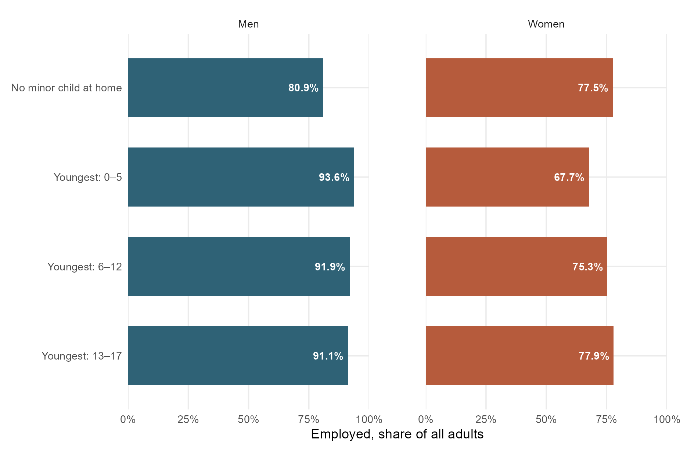
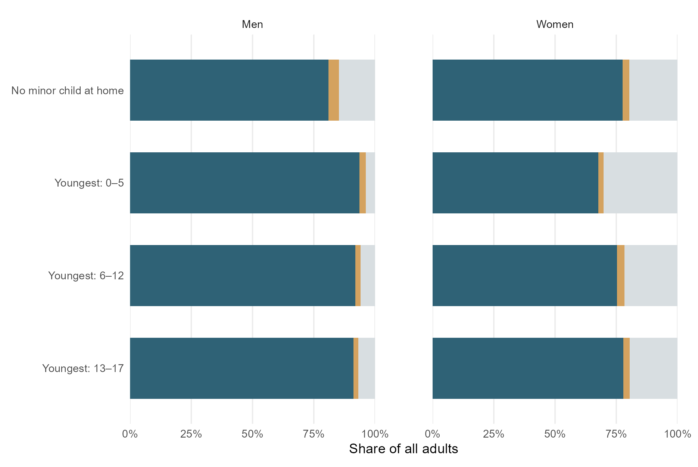
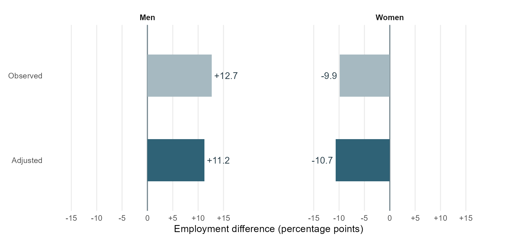

<style>
.newspaper-report {max-width:780px;margin:0 auto;color:#222;font-family:Georgia,"Times New Roman",serif;font-size:1.08rem;line-height:1.65;}
.newspaper-report > p {max-width:660px;margin:0 auto 1.15rem;}
.newspaper-report h2 {max-width:660px;margin:2.1rem auto 1rem;font-family:Georgia,"Times New Roman",serif;font-size:1.5rem;line-height:1.25;font-weight:700;color:#111;}
.newspaper-report .report-figure {display:block;float:none;box-sizing:border-box;width:100%;max-width:100%;margin:1.8rem 0 2rem;padding:0;border:0;}
.newspaper-report .report-figure figcaption {display:block;font:700 1.05rem/1.4 Arial,Helvetica,sans-serif;text-align:left;color:#111;margin:0 0 .3rem;}
.newspaper-report .figure-number {display:inline-block;margin-right:.4em;color:#666;font-weight:400;font-size:.85em;white-space:nowrap;}
.newspaper-report .figure-deck {font:.85rem/1.45 Arial,Helvetica,sans-serif;color:#666;margin:0 0 .65rem;}
.newspaper-report img.report-chart {display:block!important;float:none!important;box-sizing:border-box;width:100%!important;max-width:100%!important;height:auto!important;max-height:none!important;object-fit:contain;margin:0 auto!important;}
.newspaper-report .figure-legend {display:flex;flex-wrap:wrap;gap:.3rem 1rem;font:.78rem/1.5 Arial,Helvetica,sans-serif;margin:.5rem 0;}
.newspaper-report .legend-blue {border-left:10px solid #2f6276;padding-left:.35rem;}
.newspaper-report .legend-orange {border-left:10px solid #b65b3c;padding-left:.35rem;}
.newspaper-report .legend-green {border-left:10px solid #478578;padding-left:.35rem;}
.newspaper-report .legend-purple {border-left:10px solid #7b6388;padding-left:.35rem;}
.newspaper-report .legend-gray {border-left:10px solid #d8dee1;padding-left:.35rem;}
.newspaper-report .figure-source {font:.73rem/1.5 Arial,Helvetica,sans-serif;color:#777;margin:.4rem 0;}
.newspaper-report .report-figure details {font:.76rem/1.55 Arial,Helvetica,sans-serif;color:#666;margin-top:.45rem;}
.newspaper-report .report-figure summary {cursor:pointer;}
.newspaper-report .source-notes {font:.84rem/1.6 Arial,Helvetica,sans-serif;padding-left:1.5rem;}
.newspaper-report .source-notes li {margin-bottom:.8rem;scroll-margin-top:5rem;}
.newspaper-report a {overflow-wrap:anywhere;}
.newspaper-report sup {font-size:.7em;}
.newspaper-report .research-question {background:#fff0b3;color:inherit;padding:.08em .12em;box-decoration-break:clone;-webkit-box-decoration-break:clone;}
.newspaper-report pre {box-sizing:border-box;max-width:100%;overflow-x:auto;font-size:.76rem;line-height:1.5;}
@media(max-width:600px){.newspaper-report{font-size:1rem;}.newspaper-report h2{font-size:1.3rem;}.newspaper-report .report-figure{margin:1.3rem 0 1.6rem;}.newspaper-report .report-figure figcaption{font-size:.95rem;}.newspaper-report .figure-legend{font-size:.73rem;}}

body {max-width:900px;} main.content {max-width:900px;margin:auto;} header#title-block-header {max-width:780px;margin:0 auto 2rem;} .newspaper-report .model-spec,.newspaper-report .model-table {max-width:660px;margin:1.2rem auto;overflow-x:auto;} .newspaper-report table {font: .8rem/1.5 Arial,sans-serif;width:100%;border-collapse:collapse;} .newspaper-report th,.newspaper-report td {padding:.6em;border-bottom:1px solid #ddd;} .newspaper-report th {text-align:left;} .newspaper-report details.reproduction {font-size:.9rem;} .newspaper-report .source-notes {max-width:660px;margin:0 auto;}

.newspaper-report .legend-gold {border-left:10px solid #d4a25f;padding-left:.35rem;} .newspaper-report .legend-lightblue {border-left:10px solid #a6b9c1;padding-left:.35rem;}
</style>

```{r}
#| label: setup
#| include: false
if (!requireNamespace("ggplot2", quietly=TRUE))
  stop("Install ggplot2: install.packages('ggplot2', repos='https://cloud.r-project.org')")
qmd_input <- if (isTRUE(getOption("knitr.in.progress"))) knitr::current_input(dir=TRUE) else NULL
project_dir <- if (length(qmd_input)==1L && nzchar(qmd_input)) {
  dirname(normalizePath(qmd_input, winslash="/", mustWork=FALSE))
} else normalizePath(getwd(), winslash="/")
raw_dir <- file.path(project_dir, "data", "raw")
processed_dir <- file.path(project_dir, "data", "processed")
figure_dir <- file.path(project_dir, "result", "figures")
result_dir <- file.path(project_dir, "result", "tables")
for (d in c(raw_dir,processed_dir,figure_dir,result_dir)) dir.create(d,recursive=TRUE,showWarnings=FALSE)
invisible(Sys.setlocale("LC_TIME", "C"))
run_id <- paste0(format(Sys.time(),"%Y%m%dT%H%M%S",tz="UTC"),"-",Sys.getpid())
writeLines(paste("STARTED",run_id,"— not a completed run"),file.path(result_dir,"run_status.txt"))
# Remove this program's stale aggregate outputs; keep validation documentation.
old_tables <- list.files(result_dir,pattern="[.](csv|txt)$",full.names=TRUE)
old_tables <- old_tables[!basename(old_tables) %in% c("validation_stage1.txt","run_status.txt")]
if(length(old_tables)) unlink(old_tables)

chart_theme <- function() ggplot2::theme_minimal(base_size=12) +
  ggplot2::theme(panel.grid.minor=ggplot2::element_blank(),
    panel.spacing=grid::unit(3.5,"lines"),legend.position="bottom",plot.margin=ggplot2::margin(12,18,10,10))

# reference: preview earlier supplied output explicitly; never the default.
# microdata: download/read IPUMS, recompute estimates, then generate report.
analysis_mode <- Sys.getenv("BLOG3_ANALYSIS_MODE","microdata")
if (!analysis_mode %in% c("reference","microdata")) stop("Unknown BLOG3_ANALYSIS_MODE")
```

```{r}
#| label: estimate-or-load
#| include: false
if (analysis_mode == "microdata") {
# Run this document in RStudio/Quarto. An IPUMS CPS account and API key are
# needed on the first render. Cached data can be used without the key later.
# Step 1: check R packages. The actual API key lives in your private R session.
required <- c("ipumsr", "dplyr", "srvyr", "survey", "ggplot2", "readr", "knitr")
missing <- required[!vapply(required, requireNamespace, logical(1), quietly = TRUE)]
if (length(missing)) {
  message("Installing missing R packages: ", paste(missing, collapse = ", "))
  tryCatch(
    utils::install.packages(missing, repos = "https://cloud.r-project.org",
                            type = if (.Platform$OS.type == "windows") "binary" else "source"),
    error = function(e) message("Automatic package installation failed: ", conditionMessage(e))
  )
  missing <- required[!vapply(required, requireNamespace, logical(1), quietly = TRUE)]
  if (length(missing)) {
    stop("These packages are still missing: ", paste(missing, collapse = ", "),
         ". In the RStudio Console, run install.packages(c(",
         paste(sprintf('"%s"', missing), collapse = ", "),
         "), repos = 'https://cloud.r-project.org'), then render again.", call. = FALSE)
  }
}
# Raw licensed records remain in the user's private cache.
raw_dir <- Sys.getenv("BLOG3_CACHE_DIR",file.path(path.expand("~"), ".ipums-cps-blog3-cache"))
derived_dir <- processed_dir
for(d in c(raw_dir,derived_dir,figure_dir)) dir.create(d,recursive=TRUE,showWarnings=FALSE)
# Step 3: use a complete local extract when available, otherwise request it.
ddi_files <- list.files(raw_dir, pattern = "^cps_[0-9]+[.]xml$", full.names = TRUE)
complete_ddi <- ddi_files[
  file.exists(sub("[.]xml$", ".csv.gz", ddi_files)) |
    file.exists(sub("[.]xml$", ".dat.gz", ddi_files))
]
explicit_ddi <- Sys.getenv("BLOG3_DDI_PATH", "")
if(nzchar(explicit_ddi)) {
 if(!file.exists(explicit_ddi)) stop("BLOG3_DDI_PATH does not exist")
 complete_ddi <- explicit_ddi
}
if (length(complete_ddi) > 1L)
  stop("More than one complete CPS extract is in the private cache; keep only the 2025 ASEC extract.")
if (length(complete_ddi) == 1L) {
  ddi_path <- complete_ddi[[1]]
} else {
  if (!nzchar(Sys.getenv("IPUMS_API_KEY"))) {
    stop("Set IPUMS_API_KEY in your own RStudio session and register for IPUMS CPS. ",
         "See README.md.", call. = FALSE)
  }
  request_path <- file.path(raw_dir, "extract_request.rds")
  ddi_path <- tryCatch({
    if (file.exists(request_path)) {
      submitted <- ipumsr::get_extract_info(readRDS(request_path))
    } else {
      extract <- ipumsr::define_extract_micro(
        collection = "cps",
        description = "Blog 3: young children and employment, 2025 ASEC",
        samples = "cps2025_03s",
        variables = c("YEAR", "AGE", "SEX", "YNGCH", "EMPSTAT", "EDUC",
                      "ASECWT", "REPWTP"),
        data_format = "csv", data_structure = "rectangular"
      )
      submitted <- ipumsr::submit_extract(extract)
      saveRDS(submitted, request_path)
    }
    ready <- ipumsr::wait_for_extract(submitted,max_delay_seconds=30,timeout_seconds=1800)
    ipumsr::download_extract(ready, download_dir = raw_dir, overwrite = TRUE)
  }, error = function(e) {
    if (grepl("Invalid IPUMS registration|not registered to IPUMS cps",
              conditionMessage(e), ignore.case = TRUE)) {
      stop("IPUMS API says the account associated with this R session's API key ",
           "does not have an active CPS registration. Check that the email in the ",
           "API error matches the email of your CPS website login and the account ",
           "where you copied the key: https://account.ipums.org/api_keys . ",
           "If they match and CPS says you are already registered, contact ",
           "IPUMS User Support at ipums@umn.edu with the 401 error (never send the key). ",
           "Original API message: ", conditionMessage(e), call. = FALSE)
    }
    stop(e)
  })
}
# Step 4: read the DDI and its accompanying compressed CSV into R.
cps_raw <- ipumsr::read_ipums_micro(ddi_path)
# Only structure is exported; no person values or rows are shared.
raw_schema <- data.frame(variable=names(cps_raw),
 class=vapply(cps_raw,function(x)paste(class(x),collapse="/"),character(1)),
 missing=vapply(cps_raw,function(x)sum(is.na(x)),integer(1)))
utils::write.csv(raw_schema,file.path(result_dir,"raw_structure.csv"),row.names=FALSE)
rep_names <- grep("^REPWTP[0-9]+$", names(cps_raw), value = TRUE)
stopifnot(all(c("YEAR", "AGE", "SEX", "YNGCH", "EMPSTAT", "EDUC", "ASECWT") %in%
              names(cps_raw)), length(rep_names) == 160L,
          all(as.numeric(cps_raw$YEAR) == 2025L))
# Step 5: recode child age, employment and controls; retain eligible adults.
# EMPSTAT general code 1 = employed; 2 = unemployed; 3 = not in labor force.
# YNGCH 99 = no identified own child living in the household.
# EDUC 999 = missing or unknown. EDUC 000 may also mean no schooling, so retain it.
empstat_general <- all(as.numeric(cps_raw$EMPSTAT)[!is.na(cps_raw$EMPSTAT)] %in% 0:3)
cps <- cps_raw |>
  dplyr::mutate(
    sex = factor(as.numeric(SEX), levels = c(1, 2), labels = c("Men", "Women")),
    child_group = dplyr::case_when(
      YNGCH == 99 | (YNGCH >= 18 & YNGCH <= 98) ~ "no_minor",
      YNGCH >= 0 & YNGCH <= 5 ~ "age0_5",
      YNGCH >= 6 & YNGCH <= 12 ~ "age6_12",
      YNGCH >= 13 & YNGCH <= 17 ~ "age13_17",
      TRUE ~ NA_character_
    ),
    child_group = factor(child_group,
                         levels = c("no_minor", "age0_5", "age6_12", "age13_17")),
    status = if(empstat_general) as.numeric(EMPSTAT) else floor(as.numeric(EMPSTAT) / 10),
    employed = as.numeric(status == 1),
    labor_force = as.numeric(status %in% c(1, 2)),
    unemployed = as.numeric(status == 2),
    age_band = factor(dplyr::case_when(
      AGE <= 34 ~ "25-34", AGE <= 44 ~ "35-44", TRUE ~ "45-54"
    ), levels = c("25-34", "35-44", "45-54")),
    college = factor(ifelse(EDUC >= 111, "BA or higher", "Below BA"),
                     levels = c("Below BA", "BA or higher"))
  ) |>
  dplyr::filter(AGE >= 25, AGE <= 54, !is.na(sex), !is.na(child_group),
                status %in% c(1, 2, 3), !is.na(EDUC), EDUC != 999,
                !is.na(ASECWT), ASECWT > 0)
if (!nrow(cps)) stop("No eligible records: inspect IPUMS variable codes.")
if(any(!is.finite(as.matrix(cps[,rep_names]))) || any(as.matrix(cps[,rep_names])<0)) stop("Invalid replicate weights")
utils::write.csv(as.data.frame(table(sex=cps$sex,child_group=cps$child_group)),
 file.path(result_dir,"unweighted_group_counts.csv"),row.names=FALSE)
utils::write.csv(data.frame(variable=names(cps),
 class=vapply(cps,function(x)paste(class(x),collapse="/"),character(1)),
 missing=vapply(cps,function(x)sum(is.na(x)),integer(1))),
 file.path(result_dir,"analytic_structure.csv"),row.names=FALSE)
# Audit the sample restriction. These are unweighted person records.
n_downloaded <- nrow(cps_raw)
n_prime_age <- sum(!is.na(cps_raw$AGE) & cps_raw$AGE >= 25 & cps_raw$AGE <= 54)
n_analytic <- nrow(cps)
stopifnot(n_analytic <= n_prime_age, n_prime_age <= n_downloaded)
# Step 6: make the ASEC person-weighted survey design with all 160 replicates.
design <- srvyr::as_survey_rep(
  cps, weights = ASECWT, repweights = dplyr::matches("^REPWTP[0-9]+$"),
  type = "successive-difference", mse = TRUE
)
# Step 7: estimate eight group rates and their design-based confidence intervals.
rates <- design |>
  dplyr::group_by(sex, child_group) |>
  dplyr::summarise(
    employment = srvyr::survey_mean(employed, vartype = "ci", na.rm = TRUE),
    participation = srvyr::survey_mean(labor_force, vartype = "ci", na.rm = TRUE),
    unemployment = srvyr::survey_ratio(unemployed, labor_force,
                                        vartype = "ci", na.rm = TRUE),
    .groups = "drop"
  ) |>
  as.data.frame()
readr::write_csv(rates, file.path(derived_dir, "weighted_rates.csv"))
pick_rate <- function(s, g, col = "employment") {
  row <- rates[rates$sex == s & rates$child_group == g, , drop = FALSE]
  if (nrow(row) != 1L) stop("An expected group is missing: ", s, ", ", g)
  as.numeric(row[[col]])
}
e_w_young <- pick_rate("Women", "age0_5")
e_m_young <- pick_rate("Men", "age0_5")
e_w_none <- pick_rate("Women", "no_minor")
e_m_none <- pick_rate("Men", "no_minor")
women_gap <- 100 * (e_w_young - e_w_none)
men_gap <- 100 * (e_m_young - e_m_none)
fmt_pct <- function(x) sprintf("%.1f%%", 100 * x)
fmt_pp <- function(x) sprintf("%+.1f percentage points", x)
# Consistency check: employment = participation * (1 - unemployment).
stopifnot(max(abs(rates$employment - rates$participation *
                    (1 - rates$unemployment))) < 1e-8)
utils::write.csv(data.frame(downloaded_person_records=n_downloaded,
 prime_age_person_records=n_prime_age,analytic_person_records=n_analytic),
 file.path(result_dir,"sample_audit.csv"),row.names=FALSE)

model <- survey::svyglm(
  employed ~ sex * child_group + age_band + college,
  design = design, family = stats::gaussian()
)
b <- stats::coef(model)
V <- stats::vcov(model)
ci_critical <- stats::qt(.975, df = 159) # 160 person replicates, 159 design df.
men_term <- "child_groupage0_5"
interaction_term <- "sexWomen:child_groupage0_5"
stopifnot(all(c(men_term, interaction_term) %in% names(b)))
contrast <- function(label, terms) {
  cvec <- stats::setNames(rep(0, length(b)), names(b))
  cvec[terms] <- 1
  estimate <- sum(cvec * b)
  se <- sqrt(as.numeric(t(cvec) %*% V %*% cvec))
  data.frame(group = label, estimate_pp = 100 * estimate,
             lower_pp = 100 * (estimate - ci_critical * se),
             upper_pp = 100 * (estimate + ci_critical * se), se_pp = 100 * se)
}
adjusted <- dplyr::bind_rows(
  contrast("Men", men_term),
  contrast("Women", c(men_term, interaction_term)),
  contrast("Women minus men", interaction_term)
)
readr::write_csv(adjusted, file.path(derived_dir, "adjusted_gaps.csv"))
capture.output(summary(model), file = file.path(result_dir, "model_summary.txt"))
capture.output(sessionInfo(), file = file.path(result_dir, "session_info_full_model.txt"))
adj_w <- adjusted$estimate_pp[adjusted$group == "Women"]
adj_m <- adjusted$estimate_pp[adjusted$group == "Men"]
interaction <- adjusted[adjusted$group == "Women minus men", ]
coefficients <- data.frame(term=names(b),estimate=as.numeric(b),se=sqrt(diag(V)),
 lower=as.numeric(b)-ci_critical*sqrt(diag(V)),upper=as.numeric(b)+ci_critical*sqrt(diag(V)))
utils::write.csv(data.frame(cps_year=2025,replicates=length(rep_names),
 design_df=survey::degf(design),contrast_df=159,model_rank=model$rank,
 min_fitted=min(stats::fitted(model)),max_fitted=max(stats::fitted(model))),
 file.path(result_dir,"model_diagnostics.csv"),row.names=FALSE)
utils::write.csv(data.frame(extract_file=basename(ddi_path),ddi_md5=unname(tools::md5sum(ddi_path)),
 analysis_timestamp_utc=format(Sys.time(),tz="UTC",usetz=TRUE)),
 file.path(result_dir,"extract_provenance.csv"),row.names=FALSE)
utils::write.csv(coefficients,file.path(result_dir,"model_coefficients.csv"),row.names=FALSE)

} else {

  rates <- utils::read.csv(file.path(project_dir,"data","reference_only","weighted_rates.csv"))
  adjusted <- utils::read.csv(file.path(project_dir,"data","reference_only","adjusted_gaps.csv"))
}
# Validate supplied aggregates before drawing or writing any interpretation.
required_rate_cols <- c("sex","child_group","employment","participation","unemployment")
stopifnot(all(required_rate_cols %in% names(rates)),nrow(rates)==8L,
 !anyDuplicated(paste(rates$sex,rates$child_group)),
 all(rates$sex %in% c("Men","Women")),
 all(rates$child_group %in% c("no_minor","age0_5","age6_12","age13_17")),
 all(as.matrix(rates[,c("employment","participation","unemployment")])>=0),
 all(as.matrix(rates[,c("employment","participation","unemployment")])<=1),
 max(abs(rates$employment-rates$participation*(1-rates$unemployment)))<1e-8)
stopifnot(nrow(adjusted)==3L,all(c("group","estimate_pp","lower_pp","upper_pp","se_pp") %in% names(adjusted)),
 all(adjusted$lower_pp<adjusted$estimate_pp),all(adjusted$upper_pp>adjusted$estimate_pp),
 abs(adjusted$estimate_pp[adjusted$group=="Women"]-
 adjusted$estimate_pp[adjusted$group=="Men"]-
 adjusted$estimate_pp[adjusted$group=="Women minus men"])<1e-8)
pick_rate <- function(s,g,col="employment") {
 row <- rates[rates$sex==s & rates$child_group==g,,drop=FALSE]
 if(nrow(row)!=1L) stop("Missing group")
 as.numeric(row[[col]])
}
e_w_young <- pick_rate("Women","age0_5");e_w_none <- pick_rate("Women","no_minor")
e_m_young <- pick_rate("Men","age0_5");e_m_none <- pick_rate("Men","no_minor")
women_gap <- 100*(e_w_young-e_w_none);men_gap <- 100*(e_m_young-e_m_none)
lf_w_young <- pick_rate("Women","age0_5","participation")
lf_w_none <- pick_rate("Women","no_minor","participation")
u_w_young <- pick_rate("Women","age0_5","unemployment")
u_w_none <- pick_rate("Women","no_minor","unemployment")
adj_w <- adjusted$estimate_pp[adjusted$group=="Women"]
adj_m <- adjusted$estimate_pp[adjusted$group=="Men"]
interaction <- adjusted[adjusted$group=="Women minus men",]
# Never force a preferred direction or statistical significance.
describe_gap <- function(x) if(abs(x)<.05) "roughly equal employment" else if(x<0) "lower employment" else "higher employment"
contrast_interval <- function(s) {
 z <- adjusted[adjusted$group==s,]
 if(z$lower_pp>0) "above zero" else if(z$upper_pp<0) "below zero" else "crosses zero"
}
same_direction <- sign(women_gap)==sign(men_gap)
lf_component <- 100*(lf_w_young-lf_w_none)*(1-u_w_none)
u_component <- -100*lf_w_young*(u_w_young-u_w_none)
stopifnot(abs(lf_component+u_component-women_gap)<1e-8)
participation_note <- if(abs(lf_component)>abs(u_component)) {
 "The participation component is larger in absolute size than the unemployment component."
} else { "The unemployment component is at least as large in absolute size as the participation component." }
utils::write.csv(data.frame(component=c("Participation","Unemployment"),
 difference_pp=c(lf_component,u_component)),file.path(result_dir,"employment_decomposition.csv"),row.names=FALSE)
fmt_pct <- function(x) sprintf("%.1f%%",100*x)
fmt_pp <- function(x) sprintf("%+.1f percentage points",x)
chart_colors <- c(Men="#2f6276",Women="#b65b3c")
child_labels <- c(no_minor="No minor child at home",age0_5="Youngest: 0–5",
 age6_12="Youngest: 6–12",age13_17="Youngest: 13–17")
utils::write.csv(rates,file.path(result_dir,"weighted_rates.csv"),row.names=FALSE)
utils::write.csv(adjusted,file.path(result_dir,"adjusted_gaps.csv"),row.names=FALSE)
```

```{r}
#| label: model-table
#| include: false
model_comparison <- data.frame(
 Comparison=c("Men: young child vs no minor child", "Women: young child vs no minor child",
              "Women minus men: difference between associations"),
 raw_pp=c(men_gap,women_gap,women_gap-men_gap),
 adjusted_pp=adjusted$estimate_pp,
 adjusted_lower_pp=adjusted$lower_pp,adjusted_upper_pp=adjusted$upper_pp)
model_table <- data.frame(Comparison=model_comparison$Comparison,
 `Observed gap (pp)`=sprintf("%+.1f",model_comparison$raw_pp),
 `Adjusted gap (pp)`=sprintf("%+.1f",model_comparison$adjusted_pp),
 `Adjusted 95% interval (pp)`=sprintf("[%+.1f, %+.1f]",model_comparison$adjusted_lower_pp,model_comparison$adjusted_upper_pp),check.names=FALSE)
utils::write.csv(model_table,file.path(result_dir,"model_contrasts_display.csv"),row.names=FALSE)
utils::write.csv(model_comparison,file.path(result_dir,"model_comparison.csv"),row.names=FALSE)
```

```{r}
#| label: save-analysis
#| include: false
# Aggregate analysis objects only; no private credentials or person records.
object_names <- c("rates","adjusted","model_comparison","model_table","run_id","analysis_mode","e_w_young","e_w_none","e_m_young","e_m_none","women_gap","men_gap","lf_w_young","lf_w_none","u_w_young","u_w_none","adj_w","adj_m","interaction","lf_component","u_component","participation_note","describe_gap","contrast_interval","fmt_pct","fmt_pp","chart_colors","child_labels","chart_theme")
object_names <- object_names[vapply(object_names,function(x) exists(x,envir=.GlobalEnv,inherits=FALSE),logical(1))]
saveRDS(mget(object_names,envir=.GlobalEnv,inherits=FALSE),file.path(result_dir,"analysis_objects.rds"))
```

```{r}
#| label: fig-employment
#| include: false
fig1_data <- rates
fig1_data$family <- factor(child_labels[as.character(rates$child_group)],levels=rev(unname(child_labels)))
fig1_data$value <- 100*rates$employment
p1 <- ggplot2::ggplot(fig1_data,ggplot2::aes(family,value,fill=sex))+
 ggplot2::geom_col(width=.66,show.legend=FALSE)+
 ggplot2::geom_text(ggplot2::aes(y=value-1.7,label=sprintf("%.1f%%",value)),hjust=1,color="white",fontface="bold",size=3.4)+
 ggplot2::facet_wrap(~sex,ncol=2)+ggplot2::coord_flip()+
 ggplot2::scale_fill_manual(values=chart_colors)+
 ggplot2::scale_y_continuous(limits=c(0,100),breaks=c(0,25,50,75,100),labels=function(x)paste0(x,"%"),expand=c(0,0))+
 ggplot2::labs(y="Employed, share of all adults",x=NULL)+chart_theme()
ggplot2::ggsave(file.path(figure_dir,"figure1_employment.png"),p1,width=8.5,height=5.6,dpi=220,bg="white")
p1
```

```{r}
#| label: fig-participation
#| include: false
states <- rbind(data.frame(rates[,c("sex","child_group")],state="Employed",share=rates$employment),
 data.frame(rates[,c("sex","child_group")],state="Unemployed",share=rates$participation-rates$employment),
 data.frame(rates[,c("sex","child_group")],state="Outside labor force",share=1-rates$participation))
states$state <- factor(states$state,levels=c("Employed","Unemployed","Outside labor force"))
states$family <- factor(child_labels[as.character(states$child_group)],levels=rev(unname(child_labels)))
stopifnot(all(states$share>=-1e-8))
p2 <- ggplot2::ggplot(states,ggplot2::aes(family,100*share,fill=state))+
 ggplot2::geom_col(width=.66,position=ggplot2::position_stack(reverse=TRUE))+ggplot2::facet_wrap(~sex,ncol=2)+ggplot2::coord_flip()+
 ggplot2::scale_fill_manual(values=c(Employed="#2f6276",Unemployed="#d4a25f",`Outside labor force`="#d8dee1"),name=NULL)+
 ggplot2::scale_y_continuous(limits=c(0,100),breaks=c(0,25,50,75,100),labels=function(x)paste0(x,"%"),expand=c(0,0))+
 ggplot2::labs(y="Share of all adults",x=NULL)+chart_theme()+
 ggplot2::theme(legend.position="none")
ggplot2::ggsave(file.path(figure_dir,"figure2_labor_force.png"),p2,width=8.5,height=5.7,dpi=220,bg="white")
p2
```

```{r}
#| label: fig-adjusted
#| include: false
fig3_data <- data.frame(
 sex=factor(rep(c("Men","Women"),each=2),levels=c("Men","Women")),
 comparison=factor(rep(c("Observed","Adjusted"),2),levels=c("Adjusted","Observed")),
 gap_pp=c(men_gap,adj_m,women_gap,adj_w))
axis_max <- max(5,ceiling(max(abs(fig3_data$gap_pp))/5)*5+3)
fig3_data$label_x <- fig3_data$gap_pp+ifelse(fig3_data$gap_pp>=0,.5,-.5)
fig3_data$label_hjust <- ifelse(fig3_data$gap_pp>=0,0,1)
p3 <- ggplot2::ggplot(fig3_data,ggplot2::aes(x=gap_pp,y=comparison,fill=comparison))+
 ggplot2::geom_vline(xintercept=0,color="#788991",linewidth=.65)+
 ggplot2::geom_col(width=.5,orientation="y")+
 ggplot2::geom_text(ggplot2::aes(x=label_x,label=sprintf("%+.1f",gap_pp),hjust=label_hjust),size=4,color="#223843")+
 ggplot2::facet_wrap(~sex,ncol=2)+
 ggplot2::scale_fill_manual(values=c(Observed="#a6b9c1",Adjusted="#2f6276"),guide="none")+
 ggplot2::scale_x_continuous(limits=c(-axis_max,axis_max),breaks=scales::breaks_width(5),labels=function(x)ifelse(x==0,"0",sprintf("%+g",x)))+
 ggplot2::labs(x="Employment difference (percentage points)",y=NULL)+chart_theme()+
 ggplot2::theme(panel.grid.major.y=ggplot2::element_blank(),strip.text=ggplot2::element_text(face="bold"))
ggplot2::ggsave(file.path(figure_dir,"figure3_adjusted_gaps.png"),p3,width=8.5,height=4.1,dpi=220,bg="white")
p3
```

```{r}
#| label: save-audit
#| include: false
utils::write.csv(data.frame(series="IPUMS CPS ASEC",sample="cps2025_03s",analysis_year=2025,
 frequency="Single ASEC cross-section",reason="Intentional 2025 comparison; no 2024-2026 trend estimated",
 analysis_mode=analysis_mode,read_timestamp_utc=format(Sys.time(),tz="UTC",usetz=TRUE)),
 file.path(result_dir,"data_coverage.csv"),row.names=FALSE)

capture.output(sessionInfo(),file=file.path(result_dir,"session_info_report.txt"))
utils::write.csv(data.frame(run_id=run_id,analysis_mode=analysis_mode,microdata_model_refitted=analysis_mode=="microdata",
 figures_regenerated=TRUE),file.path(result_dir,"execution_audit.csv"),row.names=FALSE)
```

```{r}
#| label: export-review-bundle
#| include: false
writeLines(paste("COMPLETE",run_id),file.path(result_dir,"run_status.txt"))
# Aggregate-only handoff: never copy raw microdata, .Renviron or request credentials.
review_dir <- file.path(project_dir,"result","review_for_codex")
dir.create(review_dir,recursive=TRUE,showWarnings=FALSE)
for(p in list.files(review_dir,full.names=TRUE)) if(!dir.exists(p)) unlink(p)
for(d in c(result_dir,figure_dir)) {
 files <- list.files(d,full.names=TRUE)
 files <- files[grepl("[.](csv|txt|png)$",files,ignore.case=TRUE)]
 if(length(files)) file.copy(files,review_dir,overwrite=TRUE)
}
file.copy(file.path(project_dir,"EDITORIAL_WINDOW.md"),review_dir,overwrite=TRUE)
writeLines(c("Editorial status: USER RUN COMPLETED; prose still requires result review.",
 "Send this folder (or its zip) for final analysis, interpretation and recommendations.",
 "Do not add raw CPS records, API keys or .Renviron."),file.path(review_dir,"HANDOFF.txt"))
if(requireNamespace("zip",quietly=TRUE)) {
 bundle <- file.path(project_dir,"result","review_for_codex.zip")
 zip::zipr(bundle,files=list.files(review_dir,full.names=TRUE),root=review_dir)
 message("Send: ",bundle)
} else message("Send the result/review_for_codex folder; zip it in Windows Explorer if needed.")
```

::: {.newspaper-report}

<figure class="report-figure" aria-labelledby="figure-1-title">
<figcaption id="figure-1-title"><span class="figure-number">Figure 1.</span> Young children, different employment patterns</figcaption>
<p class="figure-deck">Employed adults per 100 adults, by recorded sex and youngest own child at home; ages 25–54, 2025.</p>

<div class="figure-legend"><span class="legend-blue">Men</span><span class="legend-orange">Women</span></div>
<p class="figure-source">Source: <a href="https://cps.ipums.org/cps/">IPUMS CPS ASEC</a>; author’s weighted estimates. <a href="#note-1">Population and coverage notes</a>.</p>
<details><summary>Chart notes</summary><p>Labels show weighted employment rates. The denominator is all adults in each group. “No minor child” includes adults whose own children are absent or aged 18 or older; it does not mean never a parent. Older-child groups are different households, not the young-child group followed over time.</p></details>
</figure>

A workday does not always end when a child needs collecting. Someone has to leave, arrange help or pay for care that covers the gap. For a family with a young child, fitting those hours together can matter as much as finding a vacancy.

The employment comparison differs by sex. Women living with a young child have **`r describe_gap(women_gap)`** than women with no own minor child at home, a gap of **`r fmt_pp(women_gap)`**. For men, the corresponding gap is **`r fmt_pp(men_gap)`**. One overall figure for parents would obscure that comparison.

<mark class="research-question">How does employment differ for women and men living with young children? And does the difference reflect participation in the labor force, with the same pattern remaining after age and education adjustment?</mark> The comparison concerns Americans aged 25–54 in 2025, with a young child defined as the youngest own child at home aged 0–5.<sup><a href="#note-1">1</a>, <a href="#note-2">2</a>, <a href="#note-8">8</a></sup>

## One average hides two working lives

Among women in the young-child group, **`r fmt_pct(e_w_young)`** are employed, against **`r fmt_pct(e_w_none)`** among women with no own minor child at home. The equivalent figures for men are **`r fmt_pct(e_m_young)`** and **`r fmt_pct(e_m_none)`**. These percentages count adults with a job out of all adults in each group.<sup><a href="#note-3">3</a></sup>

Figure 1 sets that comparison beside households with older children. A rate of 80% means about 80 adults in work per 100 in the group. A gap of ten percentage points means a difference of ten employed adults per 100, rather than a ten per cent relative change.<sup><a href="#note-4">4</a></sup>

For households, access to paid work can affect the ability to earn or withstand a lost wage. But the chart does not measure pay, hours or financial hardship. It also cannot show how a particular family's employment changed after a birth: each bar describes different people at one point in time.

## Beyond finding a job

Having no job is not always counted as unemployment. The labor force includes adults who are employed and those who are unemployed; people neither working nor meeting the unemployment definition are outside it. This distinction separates participation in paid work from success in finding it.<sup><a href="#note-3">3</a></sup>

Women living with a young child have a participation rate of **`r fmt_pct(lf_w_young)`**, compared with **`r fmt_pct(lf_w_none)`** in the reference group. Among participants, unemployment is **`r fmt_pct(u_w_young)`** and **`r fmt_pct(u_w_none)`**, respectively.

<figure class="report-figure" aria-labelledby="figure-2-title">
<figcaption id="figure-2-title"><span class="figure-number">Figure 2.</span> Having no job is not always unemployment</figcaption>
<p class="figure-deck">Each bar divides all adults in its group between work, job search and nonparticipation.</p>

<div class="figure-legend"><span class="legend-blue">Employed</span><span class="legend-gold">Unemployed</span><span class="legend-gray">Outside the labor force</span></div>
<p class="figure-source">Source: <a href="https://cps.ipums.org/cps/">IPUMS CPS ASEC</a>; author’s weighted estimates. <a href="#note-1">Population and coverage notes</a>.</p>
<details><summary>Chart notes</summary><p>The segments sum to 100% of all adults. The unemployed segment is not the unemployment rate, whose denominator is labor-force participants. Outside the labor force does not identify childcare as the reason for nonparticipation. Men and women use the same scale.</p></details>
</figure>

An accounting breakdown assigns **`r fmt_pp(lf_component)`** of the women's employment gap to participation differences and **`r fmt_pp(u_component)`** to unemployment differences. `r participation_note` The two components add to the observed employment gap; they do not identify what caused it.<sup><a href="#note-5">5</a></sup>

For employers and policymakers, that distinction changes the question. A participation gap prompts examination of whether paid work can fit household circumstances. An unemployment gap concerns job finding among those already in the labor force. The bars cannot distinguish care responsibilities from health, preferences or other reasons for not participating.

## What age and education can explain

Adults living with young children may differ in age and qualifications from the reference group. A weighted linear probability model compares their employment while allowing for three age bands and whether they hold a bachelor's degree. It also allows the child-group association to differ for women and men.<sup><a href="#note-6">6</a></sup>

For women, adjustment changes the gap from **`r fmt_pp(women_gap)`** to **`r fmt_pp(adj_w)`**. For men, it changes from **`r fmt_pp(men_gap)`** to **`r fmt_pp(adj_m)`**. `r if (women_gap*adj_w>0 && men_gap*adj_m>0) "Both associations retain their direction: broad age and education differences do not explain away the pattern." else "At least one association changes direction or reaches zero, making age and education important to interpreting the observed pattern."`

<figure class="report-figure" aria-labelledby="figure-3-title">
<figcaption id="figure-3-title"><span class="figure-number">Figure 3.</span> Does adjustment change the employment divide?</figcaption>
<p class="figure-deck">Young-child employment minus employment with no minor child, in percentage points.</p>

<div class="figure-legend"><span class="legend-lightblue">Observed weighted gap</span><span class="legend-blue">Adjusted for age and degree status</span></div>
<p class="figure-source">Source: Author’s weighted linear probability model; <a href="https://cps.ipums.org/cps/">IPUMS CPS ASEC</a>.</p>
<details><summary>Chart notes</summary><p>Positive bars indicate higher employment in the young-child group, negative bars lower employment. Both panels use the same signed scale and zero line. Adjusted 95% confidence intervals appear in the table below. Adjustment is a conditional association, not the effect of having a child.</p></details>
</figure>

The model's outcome is one when an adult is employed and zero otherwise. Its coefficients therefore describe differences in the probability of employment; multiplying a contrast by 100 expresses it in percentage points. The specification is:

::: {.model-spec}
$$
E_i=\alpha+\beta F_i+\sum_g\gamma_g C_{ig}
+\sum_g\delta_g(F_i C_{ig})+\boldsymbol{\theta}'A_i+\lambda B_i+u_i.
$$
:::

Here $F_i$ identifies women, $C_{ig}$ child-age groups, $A_i$ age bands and $B_i$ degree status. The no-minor-child group is the reference. The young-child contrast is $\gamma_{\text{young}}$ for men and $\gamma_{\text{young}}+\delta_{\text{young}}$ for women. The table reports those contrasts and the difference between them.<sup><a href="#note-6">6</a>, <a href="#note-7">7</a></sup>

::: {.model-table}
```{r}
#| label: display-model-table
#| include: true
knitr::kable(model_table,align=c("l","r","r","r"))
```
:::

The adjusted women's interval is **`r contrast_interval("Women")`** and the men's is **`r contrast_interval("Men")`**. The difference between the adjusted associations is **`r fmt_pp(interaction$estimate_pp)`**; its interval **`r if(contrast_interval("Women minus men")=="crosses zero") "crosses zero" else paste("is",contrast_interval("Women minus men"))`**. An interval crossing zero leaves the direction of that particular association uncertain.

Adjustment makes the comparison more specific, but it leaves partner earnings, care availability and selection into parenthood unaccounted for. The model describes an employment association among broadly comparable adults. It does not estimate what having a child would do to an individual's job prospects.

## Work and care need to fit together

The participation breakdown and adjusted comparison locate the employment difference more precisely than a single parenthood average. They do not establish which constraint caused it or how much a particular policy would change it.

Employers examining retention can assess whether schedules, leave and return-to-work arrangements fit the needs of staff with care responsibilities. Policymakers evaluating childcare provision should examine participation alongside unemployment and test whether support reaches adults who want paid work. These are priorities for assessment, rather than remedies whose effects this model has measured.

If more reliable care and workable schedules enable additional adults to participate, employment could rise without a large fall in unemployment. Testing that possibility requires evidence over time and a credible evaluation. This cross-section cannot forecast employment or household income.

## Takeaway

Young children at home are associated with different employment patterns for women and men. Their observed gaps relative to adults with no own minor child are **`r fmt_pp(women_gap)`** and **`r fmt_pp(men_gap)`**, respectively. Participation helps describe the women's comparison; age and education adjustment changes the gaps to **`r fmt_pp(adj_w)`** and **`r fmt_pp(adj_m)`**.

The practical implication is to examine access to paid work as well as job finding. Work and care arrangements deserve closer scrutiny, while uncertainty and unmeasured household circumstances limit conclusions about causes and remedies.

## Footnotes

::: {.source-notes}

1. <span id="note-1"></span> **Population, sources and coverage.** Author’s analysis of the 2025 <a href="https://cps.ipums.org/cps/">IPUMS CPS ASEC</a>, sample cps2025_03s, ages 25–54 with valid analysis variables and positive ASECWT. This is a single cross-section, not a truncated 2024–2026 series. Downloaded person records include ages and cases outside the analytic sample; sample_audit.csv documents selection. CPS is a household survey; ASEC is its annual social and economic supplement.

2. <span id="note-2"></span> **Children and recorded sex.** <a href="https://cps.ipums.org/cps-action/variables/YNGCH">YNGCH</a> describes the youngest own biological, adopted or stepchild at home. “No minor child” includes no own child present or a youngest own child aged 18 or older. It does not identify adults who have never been parents. Recorded sex is not a measure of gender identity.

3. <span id="note-3"></span> **Employment, participation and unemployment.** Employment divides employed adults by all adults in the group. Participation divides employed plus unemployed adults by all adults. Unemployment divides unemployed adults by labor-force participants; the classification includes people on temporary layoff under the applicable definition. Figure 2 instead divides every status by all adults.

4. <span id="note-4"></span> **Percentage points and household implications.** 80% minus 70% is ten percentage points, not a ten per cent relative increase. A group employment-rate difference is not a count of individuals who left work after childbirth. Household-income, hours and care mechanisms discussed in the article are interpretations to investigate, not additional estimates from these figures.

5. <span id="note-5"></span> **Participation breakdown.** Employment equals participation multiplied by one minus unemployment. With $L$ for participation, $U$ for unemployment, $y$ for young-child households and $n$ for the reference, the employment gap is $100(L_y-L_n)(1-U_n)-100L_y(U_y-U_n)$. The two components use the reference unemployment rate and the young-child participation rate. This accounting identity is not a causal decomposition.

6. <span id="note-6"></span> **Model and comparisons.** The specification is employed ~ sex * child_group + age_band + college. References are men, no minor child, ages 25–34 and below bachelor’s degree. Age bands are 25–34, 35–44 and 45–54. The linear model can produce fitted probabilities outside zero and one; model diagnostics record that limitation. Adjusted bars are coefficient contrasts at common controls, not observed employment rates.

7. <span id="note-7"></span> **Weights and uncertainty.** ASECWT supplies person weights. Uncertainty uses all 160 REPWTP person replicate weights, successive-difference replication and mse=TRUE. Contrasts use t(159) intervals and account for covariance between main and interaction terms. See <a href="https://cps.ipums.org/cps/repwt.shtml">IPUMS replicate-weight guidance</a>. Observed gaps have no intervals in this table; the displayed intervals refer to adjusted contrasts. Full parameters and diagnostics are exported on a microdata run.

8. <span id="note-8"></span> **Execution and publication status.** Execution mode: **`r if(analysis_mode=="microdata") "original microdata re-estimated in this run" else "REFERENCE PREVIEW: earlier aggregates; model not re-estimated"`**. A reference preview permits inspection of the draft. A new raw-data run and editorial review are required before final publication.

:::

## Reproducibility

`r if (exists("params") && nzchar(params[["repository-url"]])) paste0("The analysis code is available in the [GitHub repository](",params[["repository-url"]],").") else "The analysis code is included in the accompanying project."`
The standalone repository uses the following structure. Generated data and result files appear after a successful run:

```text
index.qmd
README.md
Blog3.Rproj
code/
├── 01_clean_analyze.R           # acquire/read CPS and estimate models
├── 02_make_figures.R            # generate figures and execution audit
├── blog3_analysis.R             # complete extraction of QMD R chunks
└── install_packages.R
data/
├── raw/
│   └── README.md                # private extract placement instructions
└── processed/
    ├── weighted_rates.csv  # estimates produced in microdata mode
    └── adjusted_gaps.csv
result/
├── figures/
│   ├── figure1_employment.png
│   ├── figure2_labor_force.png
│   └── figure3_adjusted_gaps.png
└── tables/
    ├── weighted_rates.csv
    ├── model_comparison.csv
    ├── adjusted_gaps.csv
    ├── employment_decomposition.csv
    ├── analysis_objects.rds     # aggregate-only objects for plot scripts
    ├── data_coverage.csv
    └── execution_audit.csv
```

To reproduce the figures, open the website's RStudio project and place this post under `blog/posts/post3/`, retaining the folder structure. Keep the corresponding IPUMS CPS extract and its XML dictionary together in a private folder. Set `BLOG3_DDI_PATH` to the dictionary path if using an existing extract; otherwise the first run requests the extract through the API. Input placement and key setup are documented in `README.md`.

Run `blog/posts/post3/code/01_clean_analyze.R`, followed by `blog/posts/post3/code/02_make_figures.R`. Render `blog/posts/post3/index.qmd` to rebuild the article and apply its figure styling.

Alternatively, open the standalone `Blog3.Rproj`, run the same scripts from `code/`, and render `index.qmd`. The complete extracted script, `code/blog3_analysis.R`, is an alternative to those two steps.

The scripts generate processed estimates, model tables and figures using project-relative output paths. The default input mode re-estimates the model from the 2025 ASEC extract using person and replicate weights. Licensed person records and API credentials remain outside the published project. Earlier aggregate files in `data/reference_only/` are used only when reference mode is explicitly selected; they cannot reproduce a fresh model fit.

:::
