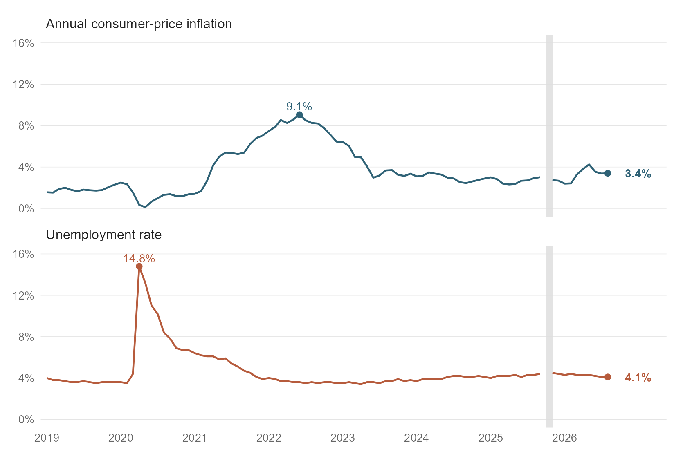
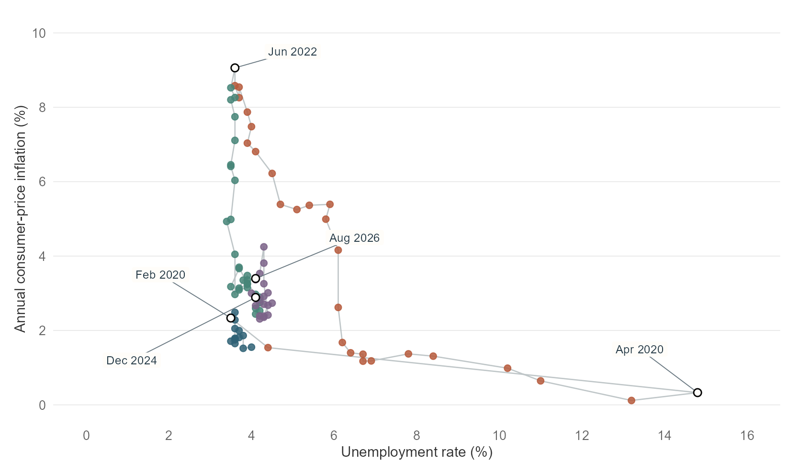
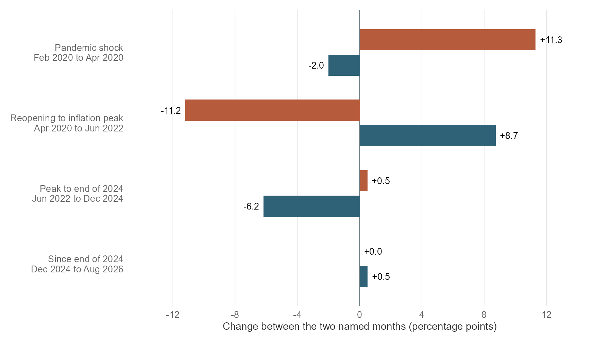

```{r}
#| label: generate-analysis-and-figures
#| include: false
# Resolve the post from the document location as well as the execution directory.
# Quarto websites may execute a document from the website project root.
analysis_env <- environment()
input_file <- knitr::current_input(dir = TRUE)
input_dir <- if (length(input_file) == 1L && nzchar(input_file)) {
  dirname(normalizePath(input_file, winslash = "/", mustWork = FALSE))
} else character()
ancestor_dirs <- function(path) {
  out <- normalizePath(path, winslash = "/", mustWork = FALSE)
  repeat {
    parent <- dirname(tail(out, 1L))
    if (identical(parent, tail(out, 1L))) break
    out <- c(out, parent)
  }
  out
}
parents <- unique(unlist(lapply(c(input_dir, getwd()), ancestor_dirs)))
candidates <- unique(c(input_dir, getwd(), file.path(parents, "blog", "posts", "post4")))
required_scripts <- file.path("code", c("00_config.R", "01_clean_analyze.R", "02_make_figures.R"))
coverage <- vapply(candidates, function(path) {
  sum(file.exists(file.path(path, required_scripts)))
}, integer(1))
post_dir <- candidates[which.max(coverage)]
missing_scripts <- required_scripts[!file.exists(file.path(post_dir, required_scripts))]
if (length(missing_scripts)) {
  stop(paste0(
    "Blog4 analysis scripts are missing or misplaced.\n",
    "Current execution directory: ", getwd(), "\n",
    "Expected post directory: ", post_dir, "\n",
    "Missing files:\n", paste(file.path(post_dir, missing_scripts), collapse = "\n"), "\n",
    "Copy the complete code/ folder from the Blog4 project ZIP beside index.qmd. ",
    "Keep data/, result/ and article.css beside it as well. Replacing the QMD alone ",
    "does not install these external scripts."
  ), call. = FALSE)
}
post_dir <- normalizePath(post_dir, winslash = "/", mustWork = TRUE)
previous_dir <- getwd()
tryCatch({
  setwd(post_dir)
  source("code/01_clean_analyze.R", local = analysis_env, encoding = "UTF-8")
  source("code/02_make_figures.R", local = analysis_env, encoding = "UTF-8")

  # Editorial presentation; keep the analysis objects and figure interfaces.
  newspaper_theme <- ggplot2::theme(
    plot.background = ggplot2::element_rect(fill = "white", colour = NA),
    panel.background = ggplot2::element_rect(fill = "white", colour = NA),
    panel.grid.minor = ggplot2::element_blank(),
    panel.grid.major.y = ggplot2::element_line(colour = "#e5e5e5", linewidth = .3),
    axis.text = ggplot2::element_text(colour = "#666666", size = 11),
    axis.title = ggplot2::element_text(colour = "#333333", size = 12),
    strip.text = ggplot2::element_text(colour = "#222222", size = 13, face = "plain", hjust = 0),
    plot.margin = ggplot2::margin(12, 25, 12, 12)
  )
  fig1 <- fig1 + newspaper_theme + ggplot2::facet_wrap(~indicator, ncol = 1,
    labeller = ggplot2::as_labeller(c(
      "Consumer-price inflation: change from a year earlier (%)" = "Annual consumer-price inflation",
      "Unemployment: share of the labor force (%)" = "Unemployment rate"))) +
    ggplot2::scale_y_continuous(limits = c(0, 16), breaks = seq(0, 16, 4),
      labels = function(x) paste0(x, "%"))
  peak_marks <- long[long$date == as.Date("2022-06-01") &
    long$indicator == levels(long$indicator)[1] |
    long$date == as.Date("2020-04-01") &
    long$indicator == levels(long$indicator)[2], ]
  peak_marks$label <- pct(peak_marks$value)
  fig1 <- fig1 + ggplot2::geom_point(data = peak_marks, size = 2.3) +
    ggplot2::geom_text(data = peak_marks,
      ggplot2::aes(label = label), nudge_y = .8, size = 4, show.legend = FALSE)
  fig2 <- fig2 + newspaper_theme
  fig3 <- fig3 + newspaper_theme + ggplot2::theme(
    panel.grid.major.y = ggplot2::element_blank(),
    panel.grid.major.x = ggplot2::element_line(colour = "#e5e5e5", linewidth = .3))
  ggplot2::ggsave(file.path(figure_dir, "figure1_inflation_and_jobs.png"),
    fig1, width = 9.4, height = 6.2, dpi = 180)
  ggplot2::ggsave(file.path(figure_dir, "figure2_changing_relationship.png"),
    fig2, width = 9.4, height = 5.5, dpi = 180)
  ggplot2::ggsave(file.path(figure_dir, "figure3_change_by_stage.png"),
    fig3, width = 10, height = 5.6, dpi = 180)
}, finally = setwd(previous_dir))
```

<style>
.blog4-report {max-width:780px;margin:0 auto;color:#222;font-family:Georgia,"Times New Roman",serif;font-size:1.08rem;line-height:1.65;}
.blog4-report > p {max-width:660px;margin:0 auto 1.15rem;}
.blog4-report h2 {max-width:660px;margin:2.1rem auto 1rem;font-family:Georgia,"Times New Roman",serif;font-size:1.5rem;line-height:1.25;font-weight:700;color:#111;}
.blog4-report .report-figure {display:block;float:none;box-sizing:border-box;width:100%;max-width:100%;margin:1.8rem 0 2rem;padding:0;border:0;}
.blog4-report .report-figure figcaption {display:block;font:700 1.05rem/1.4 Arial,Helvetica,sans-serif;text-align:left;color:#111;margin:0 0 .3rem;}
.blog4-report .figure-number {display:inline-block;margin-right:.4em;color:#666;font-weight:400;font-size:.85em;white-space:nowrap;}
.blog4-report .figure-deck {font:.85rem/1.45 Arial,Helvetica,sans-serif;color:#666;margin:0 0 .65rem;}
.blog4-report img.report-chart {display:block!important;float:none!important;box-sizing:border-box;width:100%!important;max-width:100%!important;height:auto!important;max-height:none!important;object-fit:contain;margin:0 auto!important;}
.blog4-report .figure-legend {display:flex;flex-wrap:wrap;gap:.3rem 1rem;font:.78rem/1.5 Arial,Helvetica,sans-serif;margin:.5rem 0;}
.blog4-report .legend-blue {border-left:10px solid #2f6276;padding-left:.35rem;}
.blog4-report .legend-orange {border-left:10px solid #b65b3c;padding-left:.35rem;}
.blog4-report .legend-green {border-left:10px solid #478578;padding-left:.35rem;}
.blog4-report .legend-purple {border-left:10px solid #7b6388;padding-left:.35rem;}
.blog4-report .legend-gray {border-left:10px solid #dedede;padding-left:.35rem;}
.blog4-report .figure-source {font:.73rem/1.5 Arial,Helvetica,sans-serif;color:#777;margin:.4rem 0;}
.blog4-report .report-figure details {font:.76rem/1.55 Arial,Helvetica,sans-serif;color:#666;margin-top:.45rem;}
.blog4-report .report-figure summary {cursor:pointer;}
.blog4-report .source-notes {font:.84rem/1.6 Arial,Helvetica,sans-serif;padding-left:1.5rem;}
.blog4-report .source-notes li {margin-bottom:.8rem;scroll-margin-top:5rem;}
.blog4-report a {overflow-wrap:anywhere;}
.blog4-report sup {font-size:.7em;}
.blog4-report .research-question {background:#fff0b3;color:inherit;padding:.08em .12em;box-decoration-break:clone;-webkit-box-decoration-break:clone;}
.blog4-report pre {box-sizing:border-box;max-width:100%;overflow-x:auto;font-size:.76rem;line-height:1.5;}
@media(max-width:600px){.blog4-report{font-size:1rem;}.blog4-report h2{font-size:1.3rem;}.blog4-report .report-figure{margin:1.3rem 0 1.6rem;}.blog4-report .report-figure figcaption{font-size:.95rem;}.blog4-report .figure-legend{font-size:.73rem;}}
</style>

::: {.blog4-report}

<figure class="report-figure" aria-labelledby="figure-1-title">
<figcaption id="figure-1-title"><span class="figure-number">Figure 1.</span> Unemployment surged first. Inflation followed.</figcaption>
<p class="figure-deck">Monthly rates, January 2019 to `r month_label`; both panels use the same scale.</p>

<div class="figure-legend"><span class="legend-blue">Annual inflation</span><span class="legend-orange">Unemployment</span><span class="legend-gray">October 2025 unavailable</span></div>
<p class="figure-source">Source: BLS via FRED; author's calculations. <a href="#note-6">Coverage and data notes</a>.</p>
<details><summary>Chart notes</summary><p>The panels share a calendar and a 0-16% scale. Inflation is a price-index change; unemployment is a labor-force share. Endpoint labels refer to the latest common month. Lines break across missing October 2025 observations; the gap is not a fall in either rate.</p></details>
</figure>

The steep fall in US inflation after its 2022 peak came with a surprisingly small rise in unemployment. Through December 2024, annual price growth slowed by `r num(-changes$inflation_pp[3])` percentage points, while the unemployment rate increased by just `r num(changes$unemployment_pp[3])` points.

That outcome challenges the idea that bringing inflation down must require a severe jobs downturn. But the latest readings complicate the picture: by `r month_label`, inflation was higher than at the end of 2024, while unemployment was unchanged between those endpoints.

For households, relief at the checkout matters alongside dependable work. <mark class="research-question"><strong>How have inflation and unemployment evolved together, and did falling inflation come with a sharp rise in unemployment?</strong></mark> Since 2019, their relationship has shifted repeatedly, first during the pandemic shock and then as the economy recovered.

## From lost jobs to rising bills

In February 2020, unemployment stood at `r pct(at("2020-02-01", "UNRATE"))`. Two months later, it had reached `r pct(at("2020-04-01", "UNRATE"))`, while annual inflation fell to `r pct(at("2020-04-01", "inflation"))`. The immediate strain on household budgets came from lost earnings, even as price increases slowed.

Inflation measures the rise in consumer prices; unemployment measures the share of the labor force without work and seeking it.<sup><a href="#note-1">1</a>, <a href="#note-2">2</a></sup> One erodes what earnings can buy. The other signals how many people lack a job.

As employment recovered, the pressure shifted. By `r peak_label`, unemployment had fallen to `r pct(peak$UNRATE)`, but annual inflation had climbed to `r pct(peak$inflation)`. More people could earn and spend again, yet rising bills absorbed some of that gain unless incomes kept pace.

Losing work can force households to cut spending, weakening business sales and incentives to hire or invest. Recovering employment can support consumption, but a larger pay packet provides less relief when prices rise quickly.<sup><a href="#note-5">5</a></sup> The two rates describe different strains on living standards; neither tells the whole story.

## The limits of the trade-off

The familiar Phillips curve links inflation with pressure in the labor market: when workers become harder to find, wages and prices may face upward pressure.<sup><a href="#note-3">3</a></sup> The US experience shows why that relationship cannot be read as a fixed rule.

In February 2020, unemployment was `r pct(at("2020-02-01", "UNRATE"))` and inflation `r pct(at("2020-02-01", "inflation"))`. In June 2022, unemployment was almost identical, at `r pct(at("2022-06-01", "UNRATE"))`, while inflation was roughly four times as high.

<figure class="report-figure" aria-labelledby="figure-2-title">
<figcaption id="figure-2-title"><span class="figure-number">Figure 2.</span> Almost the same unemployment, nearly four times the inflation</figcaption>
<p class="figure-deck">February 2020 and June 2022 had similar unemployment rates, but sharply different inflation.</p>

<div class="figure-legend"><span class="legend-blue">Jan 2019-Feb 2020</span><span class="legend-orange">Mar 2020-Jun 2022</span><span class="legend-green">Jul 2022-Dec 2024</span><span class="legend-purple">Jan 2025 onward</span></div>
<p class="figure-source">Source: BLS via FRED; author's calculations. <a href="#note-6">Coverage and data notes</a>.</p>
<details><summary>Chart notes</summary><p>Each dot represents a month. The gray line connects consecutive observations chronologically, with a break across October 2025; it is not a fitted Phillips curve. White circles mark selected monthly checkpoints. The colors identify descriptive periods, not estimated structural breaks. Other influences are not held constant.</p></details>
</figure>

Low unemployment alone cannot explain that difference. Bernanke and Blanchard's research on pandemic inflation points to commodity-price shocks and demand shifts against constrained supply as drivers of the initial surge, with tight labor markets adding more persistent pressure.<sup><a href="#note-7">7</a></sup>

The monthly path reflects an economy responding to several shocks. It does not isolate the effect of stronger hiring on prices or measure a Phillips curve with those other influences held constant.

## A smaller employment cost

The retreat from the inflation peak was markedly different from the pandemic collapse. Between June 2022 and December 2024, inflation fell from `r pct(at("2022-06-01", "inflation"))` to `r pct(at("2024-12-01", "inflation"))`, while unemployment rose from `r pct(at("2022-06-01", "UNRATE"))` to `r pct(at("2024-12-01", "UNRATE"))`.

That combination supports part of the case for a soft landing: substantial disinflation accompanied relatively limited deterioration in the labor market.<sup><a href="#note-4">4</a></sup> It does not establish the contribution of interest rates, or erase the losses borne by workers who became unemployed.

<figure class="report-figure" aria-labelledby="figure-3-title">
<figcaption id="figure-3-title"><span class="figure-number">Figure 3.</span> Inflation’s retreat brought a modest rise in unemployment</figcaption>
<p class="figure-deck">From June 2022 to December 2024, inflation fell `r num(-changes$inflation_pp[3])` points while unemployment rose `r num(changes$unemployment_pp[3])` points.</p>

<div class="figure-legend"><span class="legend-blue">Change in inflation</span><span class="legend-orange">Change in unemployment</span><span>Left: decrease; right: increase</span></div>
<p class="figure-source">Source: BLS via FRED; author's calculations. Changes in percentage points between named months.</p>
<details><summary>Chart notes</summary><p>Each bar subtracts the starting rate from the ending rate. The intervals differ in length. Bars represent endpoint differences, not period averages, cumulative price increases or estimated policy effects. A zero unemployment change between endpoints does not imply no movement within the interval.</p></details>
</figure>

The improvement did not continue at the same pace. By `r month_label`, inflation was `r pct(latest$inflation)`, above its December 2024 reading, while unemployment remained at `r pct(latest$UNRATE)`. Stable unemployment between those dates did not imply an uninterrupted decline in price pressures.

The next adjustment will depend partly on how the labor market cools. Research by Crust, Lansing and Petrosky-Nadeau describes a possible path through fewer vacancies rather than sharply higher unemployment, provided inflation expectations remain stable.<sup><a href="#note-8">8</a></sup> Even then, fewer openings can make finding work harder.

Policymakers should watch hiring, vacancies, participation and wage growth relative to productivity alongside inflation. Uncertain policy delays strengthen the case for weighing several indicators together.<sup><a href="#note-9">9</a></sup> Further relief would require easing price pressures while employment and purchasing power hold up; renewed supply disruptions or weaker demand could make that balance harder to sustain.

## Takeaway

Inflation and unemployment did not follow a fixed trade-off. From June 2022 to December 2024, inflation fell by 6.2 percentage points while unemployment rose by just 0.5 points. By August 2026, however, inflation had edged higher again, showing that progress was uneven.

The next test is whether price pressures can ease while jobs and real incomes hold up. Policymakers should watch hiring and purchasing power alongside headline rates: for households, lasting relief means both manageable bills and dependable earnings.

## Footnotes {#footnotes}

<ol class="source-notes">
<li id="note-1"><strong>Consumer prices, CPI and annual inflation.</strong> Consumer prices are what households pay for goods and services. The Consumer Price Index summarizes changes in a representative expenditure-weighted basket; it does not describe every household's spending pattern. Annual, or year-on-year, inflation is 100 times (the current CPI divided by its value 12 calendar months earlier, minus one). Lower positive inflation means prices rise more slowly, not that prices fall. The series is <a href="https://fred.stlouisfed.org/series/CPIAUCNS">CPIAUCNS</a>, the BLS all-items CPI for urban consumers, not seasonally adjusted.</li>
<li id="note-2"><strong>Unemployment, the labor force and participation.</strong> The labor force includes employed and unemployed people in the civilian noninstitutional population age 16 and older. Unemployed people generally must be available for work and have actively searched during the previous four weeks; those awaiting recall from temporary layoff may qualify without searching. The unemployment rate divides unemployed people by the labor force, not the entire population. Labor-force participation is the share of the relevant population in the labor force. People neither working nor seeking work are generally outside it. See <a href="https://www.bls.gov/cps/definitions.htm">BLS definitions</a>. <a href="https://fred.stlouisfed.org/series/UNRATE">UNRATE</a> is seasonally adjusted. A falling unemployment rate can reflect employment growth, participation changes, or both.</li>
<li id="note-3"><strong>Phillips curve, labor-market tightness and expectations.</strong> The Phillips curve describes a conditional relationship between inflation and labor-market slack. Its familiar downward-sloping version links lower unemployment with higher inflation while holding other influences constant. Tightness concerns the difficulty employers face finding workers, often assessed using vacancies relative to unemployed workers. Inflation expectations are beliefs about future price increases. Supply shocks, expectations and changing labor-market conditions can alter the observed relationship. Figure 2 does not fit a structural Phillips curve or test whether such a conditional relationship exists.</li>
<li id="note-4"><strong>Percentage points, disinflation and a soft landing.</strong> A rate rising from 3% to 4% increases by one percentage point, rather than by 1%. Disinflation means a declining inflation rate; deflation means falling prices. A soft landing generally means bringing inflation down without a severe economic downturn. The charts show employment and price developments, not sufficient evidence to declare that a lasting soft landing has occurred. They do not estimate GDP or individual job losses.</li>
<li id="note-5"><strong>Income, purchasing power and growth.</strong> Nominal income is income measured in dollars; real purchasing power concerns what it can buy after accounting for prices. Economic growth is an increase in real, or price-adjusted, output. Spending can support business sales, employment and investment, but inflation also depends on supply conditions and other influences. The article discusses these economic channels without estimating wages, consumption, productivity or GDP. It does not infer a household welfare change from unemployment and CPI alone.</li>
<li id="note-6"><strong>Coverage, sources and missing data.</strong> Monthly BLS series were acquired through FRED on October 6, 2026. CPI ends in August 2026 and unemployment in September, so joint analysis ends in August. Prices from 2018 supply the 12-month lags for 2019. October 2025 is unavailable in both series; no interpolation is used, and the calendar row remains. See the <a href="https://www.bls.gov/cpi/additional-resources/2025-federal-government-shutdown-impact-cpi-faq.htm">BLS CPI explanation</a> and <a href="https://www.bls.gov/cps/methods/2025-federal-government-shutdown-impact-cps.htm">CPS explanation</a>. Nearby readings also warrant caution because BLS documents atypical shutdown-related collection and processing. Snapshot values may differ from later revisions.</li>
<li id="note-7"><strong>Research on pandemic inflation.</strong> Bernanke, Ben S., and Olivier Blanchard (2023), <a href="https://www.piie.com/publications/working-papers/2023/what-caused-us-pandemic-era-inflation">What Caused the US Pandemic-Era Inflation?</a>, PIIE Working Paper 23-4. Their model emphasizes commodity and sectoral price shocks associated with demand changes and constrained supply in the initial inflation surge, and more persistent pressure from tight labor markets. This external finding does not decompose this article's full sample or establish that supply alone caused inflation.</li>
<li id="note-8"><strong>Vacancies and disinflation.</strong> Crust, Erin E., Kevin J. Lansing, and Nicolas Petrosky-Nadeau (2023), <a href="https://www.frbsf.org/research-and-insights/publications/economic-letter/2023/07/reducing-inflation-along-nonlinear-phillips-curve/">Reducing Inflation along a Nonlinear Phillips Curve</a>, FRBSF Economic Letter 2023-17. Their combined Beveridge-curve and nonlinear Phillips-curve estimates describe a possible adjustment mainly through fewer vacancies, conditional on anchored expectations. Vacancies are unfilled jobs employers are seeking to fill. Their measures are core PCE inflation and unemployment relative to vacancies, unlike this article's two indicators. The Federal Reserve's <a href="https://www.federalreserve.gov/faqs/economy_14400.htm">2% longer-run goal</a> concerns PCE inflation, not CPI.</li>
<li id="note-9"><strong>Policy transmission.</strong> Doh, Taeyoung, and Andrew T. Foerster (2022), <a href="https://www.kansascityfed.org/research/economic-bulletin/have-lags-in-monetary-policy-transmission-shortened/">Have Lags in Monetary Policy Transmission Shortened?</a>, Kansas City Fed Economic Bulletin. Their analysis finds evidence of shorter inflation-response lags after 2009 but substantial uncertainty. It supports caution about timing, not a fixed delay or a forecast for 2026. Additional monitoring priorities and the brief outlook are implications of economic mechanisms and research, not new estimates from this dataset.</li>
</ol>

## Reproducibility

The analysis code and frozen data snapshot are included in the accompanying project. The standalone repository uses the following structure:

```text
index.qmd
README.md
Blog4.Rproj
code/
├── 00_config.R                      # project paths and analysis settings
├── 01_clean_analyze.R               # clean data and calculate estimates
├── 02_make_figures.R                # generate the three figures
├── blog4_analysis.R                 # run the analysis workflow
└── render_html.R                    # optional HTML rendering fallback
data/
├── raw/
│   ├── CPIAUCNS.csv                 # saved consumer-price index series
│   ├── UNRATE.csv                   # saved unemployment-rate series
│   └── source_manifest.csv          # download URLs and snapshot metadata
└── processed/
    └── analysis_monthly.csv         # calendar-aligned monthly analysis
result/
├── figures/
│   ├── figure1_inflation_and_jobs.png
│   ├── figure2_changing_relationship.png
│   └── figure3_change_by_stage.png
└── tables/
    ├── checkpoints.csv              # rates at selected dates
    ├── stage_changes.csv            # changes in percentage points
    ├── series_availability.csv      # coverage of each series
    ├── calendar_audit.csv           # calendar and lag checks
    ├── missing_observations.csv     # unavailable observations
    ├── analysis_objects.rds         # saved analysis objects
    └── session_info.txt             # R and package versions
```

To reproduce the figures, open the website's RStudio project and place the post under `blog/posts/post4/`, retaining the folder structure. Keep the saved series at `blog/posts/post4/data/raw/CPIAUCNS.csv` and `blog/posts/post4/data/raw/UNRATE.csv`.

Run `blog/posts/post4/code/01_clean_analyze.R`, followed by `blog/posts/post4/code/02_make_figures.R`. Render `blog/posts/post4/index.qmd` to rebuild the article and apply its figure styling.

Alternatively, open the standalone `Blog4.Rproj`, run the same scripts from `code/`, and render `index.qmd`.

The scripts generate the processed monthly data, checkpoint tables and figures using project-relative paths. They use the saved CSV snapshot by default. The underlying series are [consumer prices (CPIAUCNS)](https://fred.stlouisfed.org/series/CPIAUCNS) and [unemployment (UNRATE)](https://fred.stlouisfed.org/series/UNRATE); reproducible download URLs are documented in `README.md` and `data/raw/source_manifest.csv`. No API key or IPUMS extract is required.


:::
